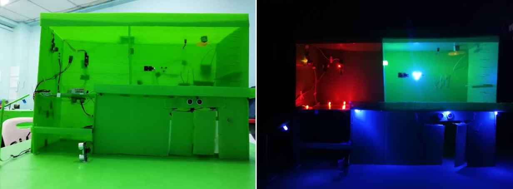

# Arduino Learning
I learned Arduino in 2018 and did projects throughout the years. This repository is a reflection of my learning journey. 

I create all items except those in the following directories: 
- **collaborations**
- **libraries**
- **useful codes by other people**.

The **in-progress** directory contains files for projects that are still under development.

Since the Arduino platform is open-source, so are my codes. Feel free to fork this repository and use them!!!

You will need to have necesssary electronics components. For an online simulator, [Tinkercad](https://www.tinkercad.com/dashboard/designs/circuits) provides basic functionalities.

For the software, you can install the Arduino IDE [from here](https://www.arduino.cc/en/software/). Note that you have to add libraries in the IDE yourself.

# Projects Preview

Some useful projects in this repository are-
- light automation
- voice-controlled bluetooth-controlled car
- fire-alarm
- traffic light
- distance measurer
- time counter
- safe lock
- smart home - `collaborations`
- line follower - `in progress`
- robot dog - `collaborations` , `in progress`

|  | /car_with_serial_circuit.png) |
|--------------------------------------------------------------------|--------------------------------------------------------------------|
|  |  |
|  | /7_segment_displays_as_counter_circuit.png) |
|  |

|  |
|--------------------------------------------------------------------|
|  |
